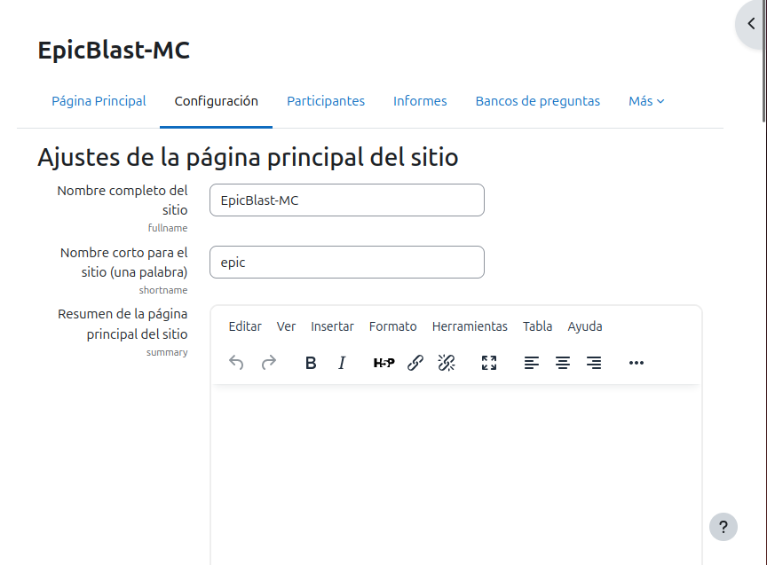
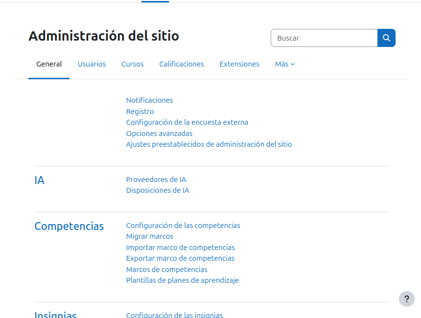
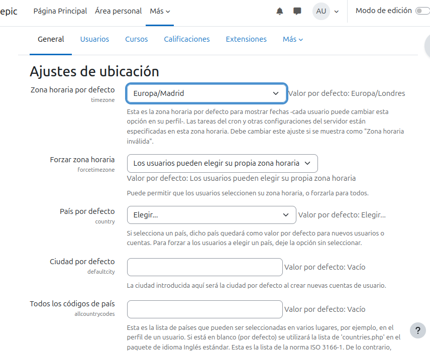

# PRACTICA TEMA 4 - INSTAL•LACIÓ I CONFIGURACIÓ DE MOODLE

*Esta práctica consiste en crear un portal Moodle de temática libre, configurándolo y explorando sus funcionalidades como administrador. A continuación, se detallan los pasos que debe seguir.*

## Configuración Inicial

### Configuración del Sitio

- *Comenzaremos primeramente configurando el Moodle desde su interior para tener una zona extra segura y entendible para aquellos que deban entrar a ver. Cambiaremos el nombre tanto largo como corto. Asimismo de poner el horario correcto y establecer el idioma necesario en nuestro moodle. No olvidemos de poner una nueva contraseña que es **vital** no ignorar.*

.

- *Aqui dentro de la administración del sitio podremos hacer el resto de cosas aparte de cambiar el nombre como he explicado anteriormente, como el horario, idioma o seguridad.*

.

- **HORARIO: (en mi caso he elegido Madrid/España porque donde vivo no es obligatorio para vosotros)**

.

- **IDIOMA: (Aqui es donde podrás instalar paquetes del idioma seleccionado y actualizarlo, hará que puedas seleccionar qué idioma quieres para el Moodle en general)**

