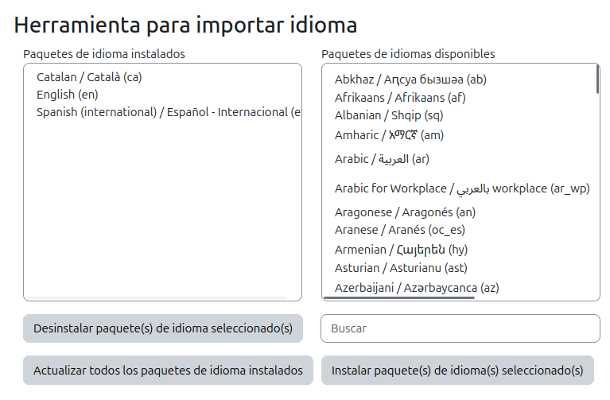
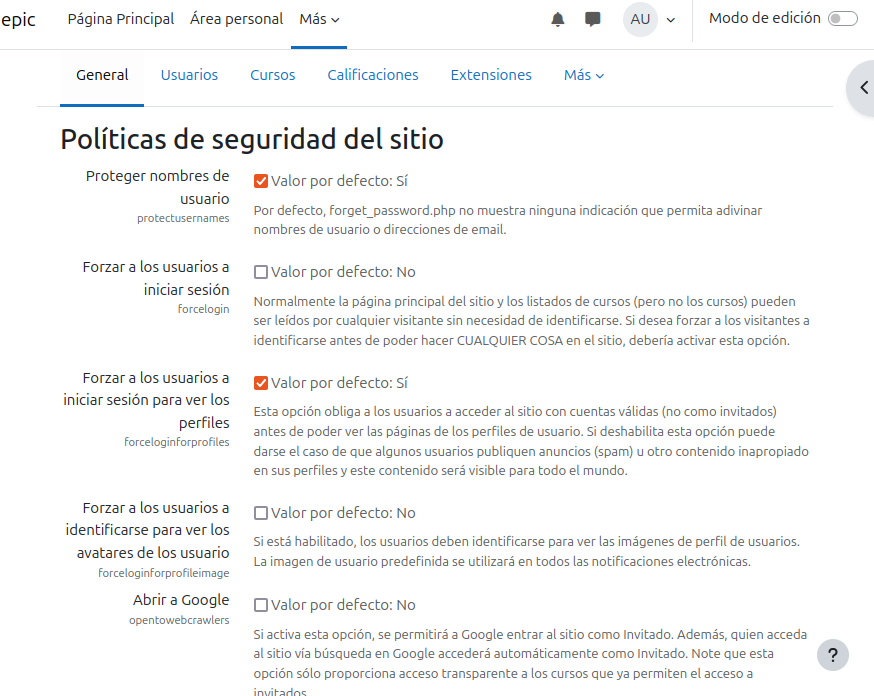
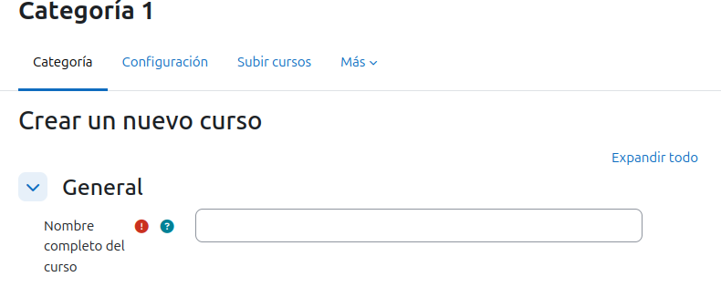
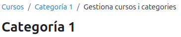

# PRACTICA TEMA 4 - INSTAL•LACIÓ I CONFIGURACIÓ DE MOODLE

*Esta práctica consiste en crear un portal Moodle de temática libre, configurándolo y explorando sus funcionalidades como administrador. A continuación, se detallan los pasos que debe seguir.*

## Configuración Inicial

### Configuración del Sitio

- *Comenzaremos primeramente configurando el Moodle desde su interior para tener una zona extra segura y entendible para aquellos que deban entrar a ver. Cambiaremos el nombre tanto largo como corto. Asimismo de poner el horario correcto y establecer el idioma necesario en nuestro moodle. No olvidemos de poner una nueva contraseña que es **vital** no ignorar.*

.

- *Aqui dentro de la administración del sitio podremos hacer el resto de cosas aparte de cambiar el nombre como he explicado anteriormente, como el horario, idioma o seguridad.*

.

- **HORARIO: (en mi caso he elegido Madrid/España porque donde vivo no es obligatorio para vosotros)**

.

- **IDIOMA: (Aqui es donde podrás instalar paquetes del idioma seleccionado y actualizarlo, hará que puedas seleccionar qué idioma quieres para el Moodle en general)**

.

- **SEGURIDAD: (Aqui podremos configurar todo lo relacionado a la seguridad y permisos de nuestro Moodle, y además, las contraseñas para poder jugar con estas de la manera más segura y fácil)**

.

## Creación de cursos 

- *En la página principal del Moodle, en el botón de creación de "crear un nuevo curso", lo cliquearemos y nos llevará a una zona donde podremos configurar como será el curso antes de poder traerlo a la vida. Con eso, crearemos 2 cursos, uno llamado A con 3 temas y el otro llamado B con 5 temas. Una vez creados, accederemos nuevamente a la administración del lugar y de ahi al apartado de "gestiona cursos y categorias" **(La cual es otra manera de poder configurar o crear un curso)***

.

.

## Creacion y gestión de usuarios

- *Crearemos manualmente un usuario llamado Bob con autenticación manual, para ello iremos nuevamente a Administracion del Lugar, buscaremos usuarios y entraremos de ahí a cuentas, para finalmente añadir un usuario.*

